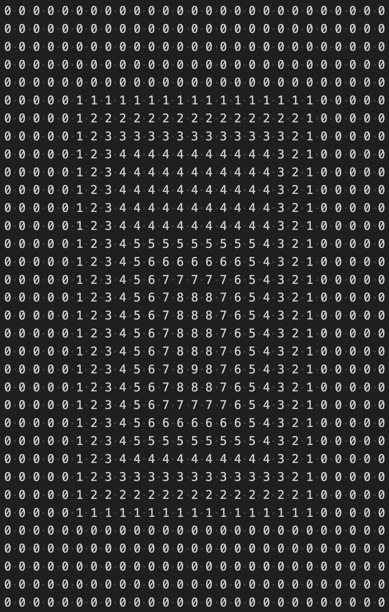
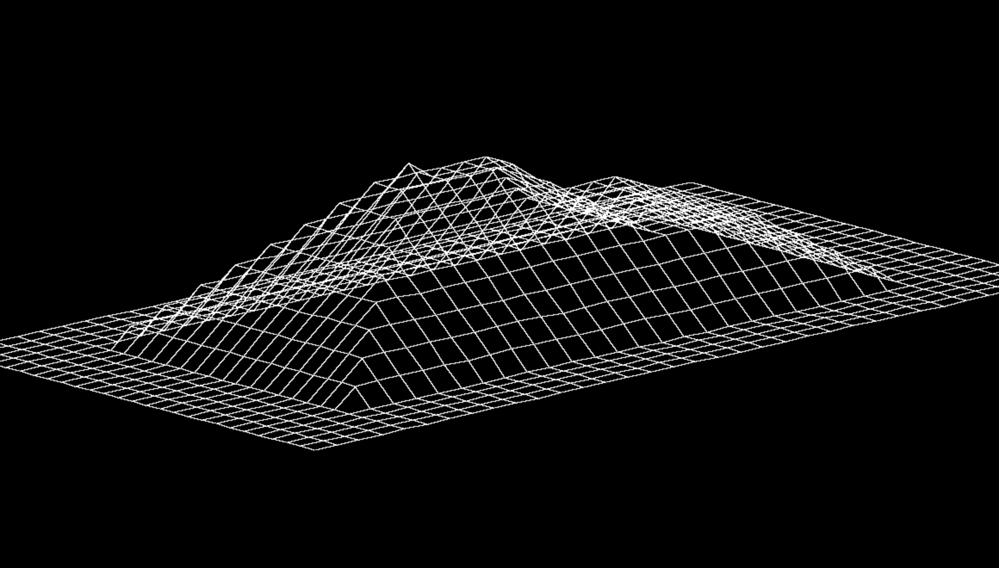
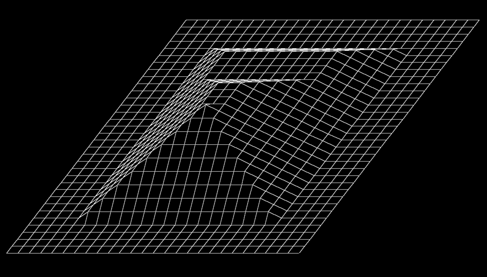

# Wireframe Model

	A program that that turns an input file to a Wireframe Model.

## More details

The input file is a simple text file that has numbers seperated by spaces, lets take for example this top-down of a pyramid:

The numbers in this file represent the elevation of that point.
The result of this specific input looks like this:

The program also accepts following user input:

* W,S keys to rotate around the models X axis.
* A,D keys to rotate around the models Y axis.
* Q,E keys to rotate around the models Z axis.
* Arrow keys to move the model inside of the window.
* Mouse scroll to zoom in and out.
* +,- keys to increase or decrease the models elevation.

These operations are shown in this gif:

## How?

This program is entirely written in C, using MiniLibX and my [LibFT](https://github.com/fotogiorgo/libft) library.

MiniLibX is a small library which implements some basic functions that allow you to open a window and draw pixels in it.